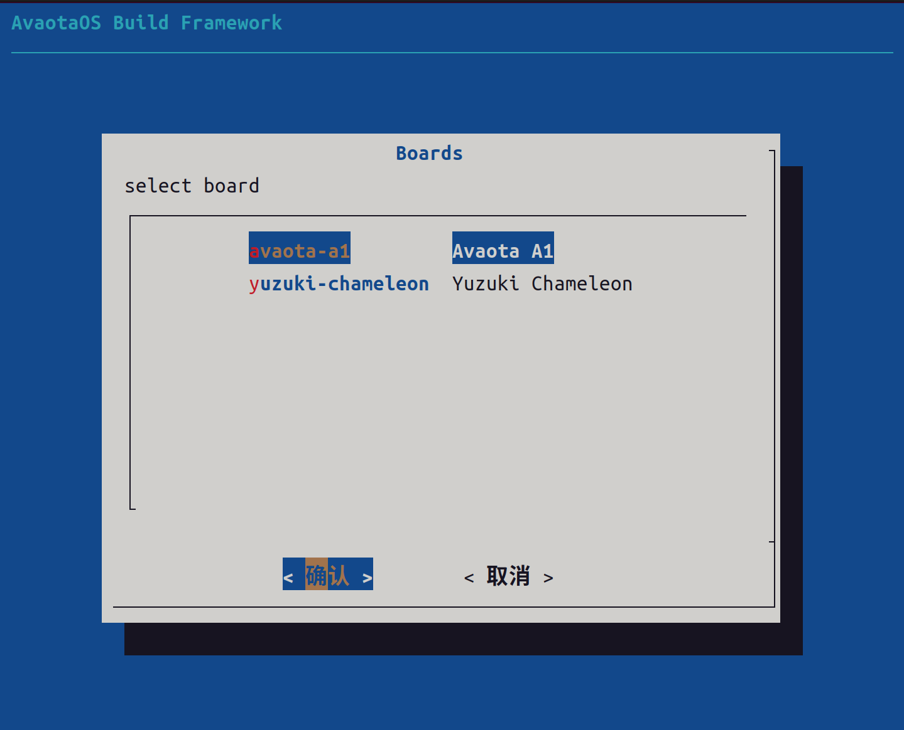

```plaintext
                                                  __
                                                 d888b
                                                888888b
                                                8888888
                                                8888888
                                                8888888
                                     _          8888888
                                   ,d88         8888888
                            ____  d88' _,,      888888'
                           (8888\ 88' d888)     Y8888P
                           ___~~8 ~8  88~___    d8888
  _______              ,8888888        ~ 888888_8888
,8888888888===__    _,d88P~~               ~~Y88888'
88888888888888888888888'                        `88b
8888888888888888888888P                          Y88
`~888888888888~~~~~ 88                            88
    ~~~~~~~~        88                            88
                    88                            88
                    88                            88
                    88                            88
                    88    ,aa.            ,aa.    88
                    88    d88b            d88b    88
                  ,=88    Y88P            Y88P    88=,
                ,d88P'     `'     _aa_     `'     `Y88b,     ___
                88P'             (8888)             `Y88  ad88888b
                88                ~^^~                88 d88Y~~"Y8b
         _______"Yb._                              _.d8"d8Y      88
 ______,d88888888ba888=,.______________________.,=8888~d88_______88___
|~~~~~~88P~~~~~~Y88~~~~~~~~~~~~~~~~~~~~~~~~~~~~~~~~~~~~~~~~~~~~~~~~~~~|
|      88        88                                                   |
|      88        88                                                   |
|      88ba,___,d8P                                                   |
|       "888888888                                                    |                                                                 |
|            ___                    __        ____  _____             |
|           /   |_   ______ _____  / /_____ _/ __ \/ ___/             |
|          / /| | | / / __ `/ __ \/ __/ __ `/ / / /\__ \              |
|         / ___ | |/ / /_/ / /_/ / /_/ /_/ / /_/ /___/ /              |
|        /_/  |_|___/\__,_/\____/\__/\__,_/\____//____/               |
|                                                                     |
|_____________________________________________________________________|
~~~~~~~~~~~~~~~~~~~~~~~~~~~~~~~~~~~~~~~~~~~~~~~~~~~~~~~~~||~~~~~~~~~~~~ 
                                                         ||
   _____            _____________________________________||__________________
 z$$$$$$$$$$$$$$$$$$$$$$$$$$$$$$$$$$$$$$$$$$$$$$$$$$$$$$$$$$$$$$$$$$$$$$$$$$$$$
J$`                                                                          4$
$F                                                                           4$
$F                                 AvaotaOS                                  4$
$F                           For AvaotaSBC Boards                            4$
'$b                                                                         d$'
  '$$$$$$$$$$$$$$$$$$$$$$$$$$$$$$$$$$$$$$$$$$$$$$$$$$$$$$$$$$$$$$$$$$$$$$$$$'

```

# AvaotaOS Build Framework

<a href="#avaota-build"></a>

## Info

```plaintext
username: avaota
password: avaota

username: root
password: avaota
```

## Prebuilt Download

You can download prebuilt images from the [releases](https://github.com/AvaotaSBC/AvaotaOS/releases) section.

The format of the prebuilt image file is `UBUNTU_VERSION-SYS_TYPE-ARCH-BOARD.img.xz`.

## How to Build

1. Clone the AvaotaOS repository:

```plaintext
git clone --depth=1 https://github.com/AvaotaSBC/AvaotaOS && cd AvaotaOS
```

2. Run the build script:

```plaintext
sudo ./build_all.sh
```

Alternatively, you can provide build parameters:

```plaintext
sudo ./build_all.sh \
    -b <BOARD> \
    -m <MIRROR> \
    -v <SYSTEM_DISTRO> \
    -t <SYS_TYPE> \
    -u <SYS_USER> \
    -p <USER_PASSWORD> \
    -s <ROOT_PASSWORD> \
    -k <IF_MENUCONFIG> \
    -g <KERNEL_TARGET> \
    -i <GITHUB_MIRROR> \
    -o <KERNEL_ONLY> \
    -e <USE_CCACHE>
```

## Build Parameters

- `BOARD`: avaota-a1

- `SYSTEM_DISTRO`:
  1. Ubuntu-22.04: jammy
  2. Ubuntu-24.04: noble
  3. Debian-11: bullseye
  4. Debian-12: bookworm
  5. Debian-13: trixie

- `MIRROR`:
  - Example: `http://ports.ubuntu.com`
  - Example: `http://deb.debian.org/debian`
  - Example: `https://mirrors.ustc.edu.cn/ubuntu-ports`
  - Example: `https://mirrors.ustc.edu.cn/debian`

- `SYS_TYPE`:
  1. cli
  2. xfce
  3. gnome
  4. kde
  5. lxqt

- `SYS_USER`: (default: avaota)

- `USER_PASSWORD`: (default: avaota)

- `ROOT_PASSWORD`: (default: avaota)

- `KERNEL_MENUCONFIG`:
  1. yes
  2. no
  
- `KERNEL_TARGET`:
  1. bsp
  2. mainline-lts
  3. mainline-latest

- `LOCAL`:
  - Don't fetch and update kernel, u-boot/syterkit from git sources.
  - Do not set to "yes" on the first run!
  1. yes
  2. no

- `GITHUB_MIRROR`:
  - Example: `https://mirror.ghproxy.com`

- `KERNEL_ONLY`: (Only build kernel packages)
  - 1. yes
  - 2. no
  
- `USE_CCACHE`:
  - 1. yes
  - 2. no

Example:

```plaintext
sudo bash build_all.sh \
    -b avaota-a1 \
    -m https://mirrors.ustc.edu.cn/ubuntu-ports \
    -v jammy \
    -t cli \
    -u avaota \
    -p avaota \
    -s avaota \
    -k no \
    -i no \
    -o no \
    -e no
```

